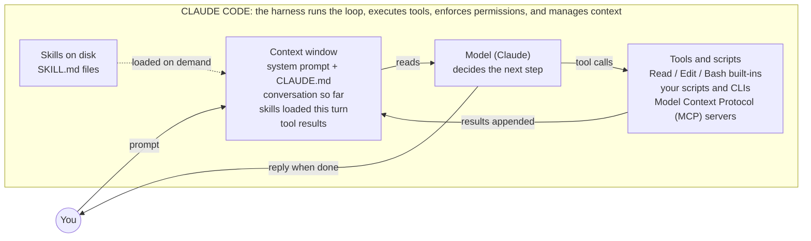
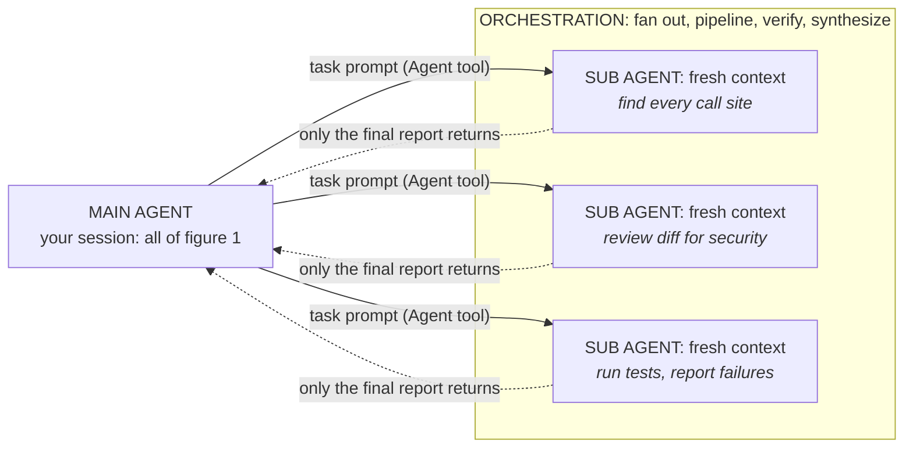

# Anatomy of an agent

Companion to the visual [`agent-anatomy.html`](agent-anatomy.html). Terms such as
harness, agent, tool, skill, sub agent, orchestration, meta-harness, and Claude
Code describe three views: what an agent contains, how agents scale within a
session, and how whole sessions are managed from outside.

## Figure 1: inside one agent



On each pass, the model reads the context. It either calls a tool, whose result
is appended to context before the loop repeats, or replies. Skills do not
execute. They are instructions loaded into context when relevant.

The harness, model, tools, and context running as a loop form an agent.

## Figure 2: scaling out



Each sub agent is another instance of figure 1 with a fresh, separate context.
Intermediate work stays outside the main agent's context; only reports return.
Orchestration is the coordination pattern: which agents run, in what order, and
how their results combine. It is not a separate component.

## Figure 3: meta-harnesses

Meta-harnesses such as Tidewave, session managers, and agent boards do not
implement the agent loop. They spawn an existing harness through Claude Code
headless mode or the Agent software development kit (SDK), then add browser UI,
parallel sessions per worktree, review queues, and runtime integration. Their
unit of work is a whole agent session, not a tool call.

```text
Model (Claude)
└── wrapped by Harness (Claude Code, Codex, OpenCode): owns the agent loop
    └── wrapped by Meta-harness (Tidewave, session managers): owns whole sessions
```

Orchestration and meta-harnesses work at different boundaries. Orchestration
spawns sub agents inside one session; a meta-harness drives whole sessions from
outside. Tidewave spans both boundaries: it drives Claude Code and serves MCP
tools into those sessions.

When the inner harness remains Claude Code, its plugins, skills, hooks, and
telemetry continue to work. The `app.entrypoint` telemetry attribute
distinguishes `cli`, `sdk`, and integrated development environment (IDE) entry
points, so meta-harness use is measurable. If a wrapper replaces the inner
harness with Codex or OpenCode, only the portable `.agents/skills` layer follows.

## Key distinctions

- Skill vs tool: a skill tells the model how; a tool lets it act. Skills enter
  the context, while tools are called from it.
- Agent vs harness: the harness is the runtime; the agent is the running system,
  including the model.
- Skill vs sub agent: both package expertise. A skill keeps work in the current
  context; a sub agent works in a separate context and returns a conclusion.
- Sub agent vs orchestration: a sub agent is one delegate; orchestration is the
  coordination pattern across delegates.

## Where this repo fits

The marketplace distributes plugins. Plugins carry skills, sub agent
definitions, hooks, and MCP or Language Server Protocol (LSP) configuration.
Claude Code loads them into sessions. Each session is an agent that can
orchestrate more agents.

Full breakdown table and on-disk layout: [`concepts-and-layout.md`](concepts-and-layout.md).
