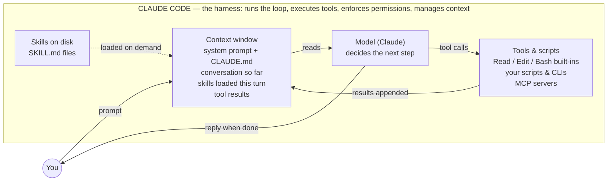
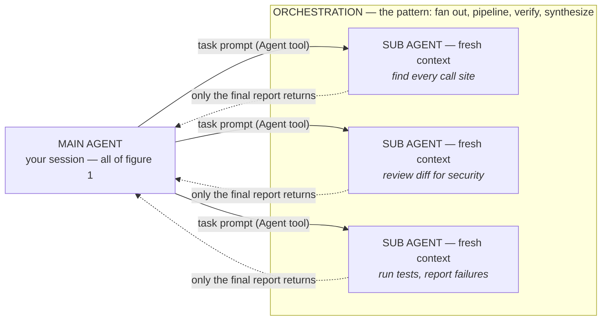

# Anatomy of an Agent

Companion to [`agent-anatomy.html`](agent-anatomy.html) (the visual — open in a
browser). Seven terms that get used interchangeably are really two pictures:
what **one agent** is made of, and how agents **scale out**.

## Figure 1 — inside one agent

The loop: the model reads the context, then either **calls a tool** (result is
appended to context, loop repeats) or **answers you**. Skills never execute —
they are instructions pulled into the context when relevant.

**Harness + model + tools + context, looping until the job is done = an agent.**

## Figure 2 — scaling out

Each sub agent is a complete copy of figure 1 with an empty context window. The
main agent's context stays clean — intermediate work happens elsewhere, only
conclusions come back. **Orchestration is not a component**; it's the shape of
the arrows: which agents run, in what order, how results combine.

## Distinctions that do the work

- **Skill vs tool** — a skill tells the model *how*; a tool lets it *do*.
  Skills flow into the context; tools are called out of it.
- **Agent vs harness** — the harness is the engine; the agent is the whole car
  in motion, model included.
- **Skill vs sub agent** — both package expertise. A skill keeps the work in
  *your* context; a sub agent takes it *elsewhere* and returns the conclusion.
- **Sub agent vs orchestration** — one delegate vs the management structure
  over many.

## Where this repo fits

Marketplace distributes plugins → plugins carry skills, sub agent definitions,
and tool configs → the harness (Claude Code) loads them into every session →
each session is an agent that can orchestrate more agents.

Full breakdown table and on-disk layout: [`concepts-and-layout.md`](concepts-and-layout.md).
