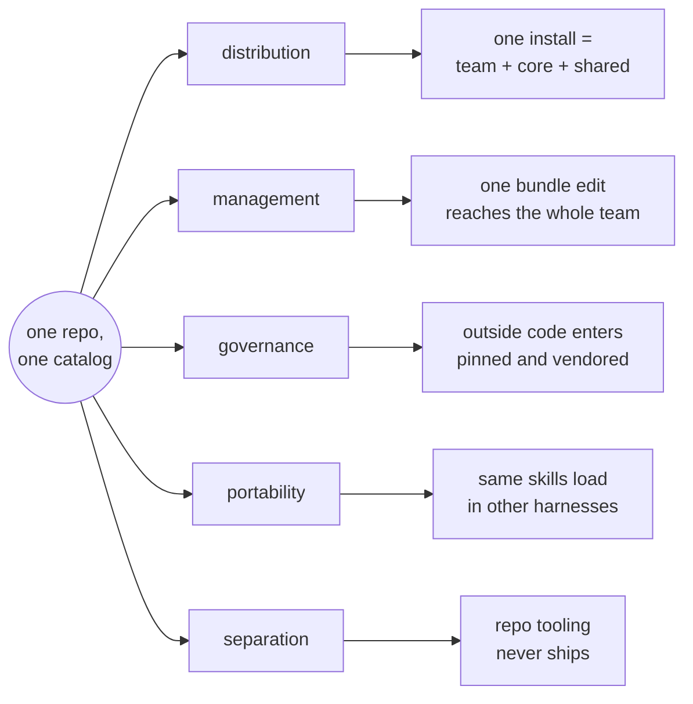
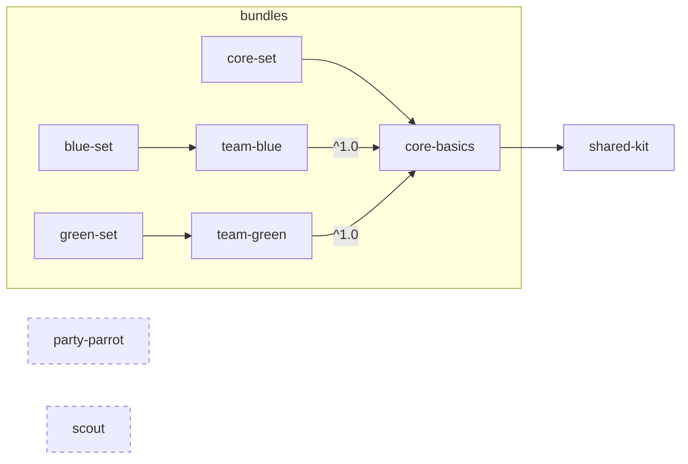
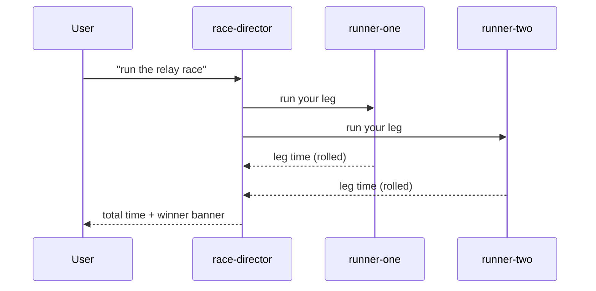

# POC: a marketplace you can demo, not just validate

```text
status   built and verified live on v2.1.233; demo-ready
         every DEMO.md act ran, every 🏓 marker checked
finding  no auto-update exists; a release lands in three commands
next     push to GitHub, rehearse DEMO.md against the remote
```

## What we are validating

One repo carries every agent asset an org shares, and the catalog that
distributes them. The docs here verified each mechanism alone. This POC
runs them together, live, and settles one question: does the whole thing
stand up in front of people.



| Validating | The POC answers | Grounded in |
| --- | --- | --- |
| Distribution | Does one install deliver a team's full set, with no copied files? | README, concepts-and-layout |
| Management | Does one bundle edit reach the whole team, visibly, live? | README, ORG-DISTRIBUTION |
| Governance | What does vetted third-party code look like in practice? | README (vetting), automation |
| Portability | Do the same skills load in OpenCode and Codex? | multi-harness, `dist/` |
| Separation | Can the repo carry its own tooling without ever shipping it? | `tools/` today |

The pass condition: every row demonstrated live, in order, from the
runbook, nothing hand-waved.

## Why

The repo answers "does this work" but not "why would my team want this".
Every mechanism is verified on v2.1.233: bundles install, dependencies
resolve transitively, tags filter in `/plugin`, versions pin against Git
tags. What is missing is the experiment you can put in front of people. The
current content was built to test the machinery, so a demo of it looks like
the test suite it is:

```diff
-"ping team-a"     →  🏓 pong from team-a v1.1.0      a string round-tripped
+"standup"         →  banner + status from team-blue   a team shipped behavior
-install team-set  →  team-a, team-b, team-c, core-b   what are these?
+install blue-set  →  team-blue + core + shared kit    the org, in one install
```

Same plumbing, different content. The POC keeps the verified machinery
untouched and gives it a small cast worth watching: one catalog, a core
everyone gets, two teams that own their folders, shared scripts nobody
copies, one vetted outsider, and a release triggered mid-demo that the
audience watches arrive in Claude Code.

The content stays deliberately silly (banners, dice, a relay race) so no
domain knowledge is needed and nothing upstages the mechanism on display.
The structure underneath is where the seriousness lives, and it is vendor
agnostic: skills stay portable through the existing `dist/` build, while
the Claude-only pieces (hooks, bundles, catalog) sit isolated where another
harness would plug in its own equivalents.

## Objectives

Each requirement, where it lives, the moment in the demo that proves it,
and the existing document that already grounds the mechanism:

| Objective | Proven by | Demo act | Grounded in |
| --- | --- | --- | --- |
| Published marketplace, demoable live | GitHub repo, `marketplace add <owner>/<repo>` from a clean machine | 1 | README (production checklist) |
| All management levers: shared, categories, tags, layout | catalog entries + folder ownership boundaries, browsed in `/plugin` | 3 | README (design), concepts-and-layout |
| Managing plugins and teams | bundles as the managed unit, one-line change fans out to a team | 6 | README (central management), ORG-DISTRIBUTION |
| A triggerable update, visible in Claude Code | `tools/ship.sh` then `plugin update blue-set@acme` lands a new skill | 6 | README (central management) |
| Share and distribute without duplication | `shared-kit` reached transitively by both teams, single copy on disk | 1, 2 | README (dependencies), concepts-and-layout |
| Core + 2 teams + vendored example | `core-basics`, `team-blue`, `team-green`, `party-parrot` | 1-6 | README (vetting), automation.md |
| Independent agent | `scout`, a plugin that is one agent file | 3 | concepts-and-layout |
| Skills, sub agents, tools and scripts from a shared location | `team-blue` component tour + `shared-kit` scripts | 2 | concepts-and-layout, agent-anatomy |
| Orchestration | `team-green` relay race, director fanning out to runners | 4 | concepts-and-layout |
| CLI and tools separate from distribution | `tools/acme` reads the catalog but never installs from it | 5 | `tools/` as it exists today |
| Vendor-agnostic core structure | `dist:build` projects the same skills into OpenCode/Codex | close | multi-harness.md, `dist/` |
| Copy-pastable demo commands with clean output | `DEMO.md`, expected output stated per block | all | README (local testing sequences) |

## What we build

A published marketplace (GitHub) with this cast:

```text
market-place-setup/
├── .claude-plugin/marketplace.json     catalog: categories + tags (the levers)
├── plugins/
│   ├── shared/shared-kit/              scripts + skills, the single copy
│   ├── core/core-basics/               what everyone gets, depends on shared-kit
│   ├── team/team-blue/                 full component tour: skill, agent, hook, script
│   ├── team/team-green/                orchestration: director + two runners
│   ├── agents/scout/                   an independent agent, alone in its plugin
│   ├── vendored/party-parrot/          fake third-party, the vetting story
│   └── bundles/                        core-set, blue-set, green-set (managed units)
├── tools/                              repo tooling, never distributed
│   ├── acme                            silly CLI: renders the catalog as a table
│   ├── ship.sh                         the live-update trigger
│   ├── timewarp.sh                     release toggle for the talk track
│   └── build-dist.py, ...              existing multi-harness build (kept)
├── dist/agents/skills/                 portable skills for OpenCode/Codex (kept)
└── DEMO.md                             copy-paste runbook, act by act
```

The current `team-a/b/c`, `core-a/b`, `shared-a/b`, and `medic` placeholders
retire. Their mechanics all survive in the new cast; the medic/diagnose
group is the one thing dropped rather than renamed, since two teams plus
core plus shared already covers every grouping lever.

### Who depends on whom



Install `blue-set` and you get `team-blue`, `core-basics`, and `shared-kit`
in one command. That transitive chain is the no-duplication argument: both
teams use the shared scripts, neither team's folder contains a copy, and
the platform team owns the only one that exists.

`scout` and `party-parrot` start unreferenced on purpose. `scout` is there
to handpick from `/plugin` by category. `party-parrot` waits offstage for
the live-update act.

## Content design

Every skill, agent, and script answers with a marker line naming its plugin
and version (the existing `🏓 pong from <name> v<version>` convention).
During the demo this is the proof of what actually loaded, not what we
claim loaded.

### shared-kit: scripts distributed from one place

The shared plugin carries the only copy of the demo scripts and the skills
that call them:

```text
plugins/shared/shared-kit/
├── .claude-plugin/plugin.json
├── skills/
│   ├── banner/SKILL.md      "run ${CLAUDE_PLUGIN_ROOT}/scripts/banner.sh <text>"
│   └── roll/SKILL.md        "run ${CLAUDE_PLUGIN_ROOT}/scripts/roll.sh"
└── scripts/
    ├── banner.sh            prints TEXT in a box, plus the marker line
    └── roll.sh              rolls 2d6, prints the result
```

`banner.sh` is ten lines of POSIX shell, no dependencies, safe to read
aloud in a vetting conversation. The point on stage: team-blue's standup
skill says "make a banner" and the banner comes from shared-kit's cache
directory, because `${CLAUDE_PLUGIN_ROOT}` resolves per plugin. One copy,
two consumers, zero path hacks.

### core-basics: what everyone gets

One skill, `hello`, that greets using the shared banner. Its `plugin.json`
declares `shared-kit` as a dependency, which is how the transitive chain in
the graph above starts. Small by design; the core exists to prove that a
baseline set rides along with every team install.

### team-blue: one of every component type

Blue inherits team-a's job as the full tour:

```text
plugins/team/team-blue/
├── .claude-plugin/plugin.json     depends on core-basics (^1.0), wires hooks
├── skills/standup/SKILL.md        say "standup" → banner + three status lines
├── agents/blue-reporter.md        sub agent: returns a one-line report
├── hooks/hooks.json               SessionStart → scripts/ping.sh
└── scripts/ping.sh                the marker line in session-start output
```

Four verifications, one plugin, all visible in
`claude plugin details team-blue@acme` (expects 1 skill, 1 agent, 1 hook).

### team-green: orchestration

Green demonstrates that orchestration is behavior, not a file type
(docs/concepts-and-layout.md already makes this argument; green makes it
runnable). A `race-director` agent fans out to two runner sub agents and
combines their answers:



Three markdown files in `agents/`, one skill that tells the main session to
spawn the director. Each runner "runs" by rolling shared-kit's dice, so the
total differs every demo, which reads better on stage than a fixed answer.

### scout: the independent agent

A plugin containing exactly one file that matters: `agents/scout.md`. Ask
for the scout and it reports what is installed from the catalog. It exists
to show the smallest useful plugin and to give the `agents` category a
resident, so handpicking in `/plugin` has something to find.

### party-parrot: the vendored outsider

A fake third-party plugin living under `plugins/vendored/`, with one
`celebrate` skill. Its catalog entry is written the way a real vetted
external would be, and a comment block in DEMO.md shows the SHA-pinned
GitHub form from the vetting playbook
(docs/objectives/plugin-vetting.md) next to it. The audience sees
both: what we run (the vendored copy we control) and how we would pin the
upstream (ref + sha, PR history as audit trail).

## Repo tooling stays out of the marketplace

`tools/` already holds `build-dist.py`, `install-skills.sh`, and the vendor
scripts. None of them ship to users, which is the point: the repo is both a
distribution catalog and a normal codebase with its own tooling, and the
marketplace only sees what `marketplace.json` lists.

The silly example that makes this visible on stage is `tools/acme`, a small
CLI that renders the catalog as a table:

```text
$ tools/acme catalog
PLUGIN        CATEGORY   TAGS                 BUNDLE
shared-kit    shared     shared, scripts      (via core-basics)
core-basics   core       core                 core-set
team-blue     team       team, blue           blue-set
team-green    team       team, green          green-set
scout         agents     agent, standalone    (none)
party-parrot  vendored   external, vetted     (none)
```

It reads `marketplace.json` and each `plugin.json`, nothing more. Installing
every plugin in the catalog never installs `acme`, and that asymmetry is
the demonstration.

## The live update: a release the audience watches land

`tools/ship.sh` performs the central-management exercise from the README as
a single scripted action. It adds `party-parrot` to `blue-set` and bumps
the bundle:

```diff
 {
   "name": "blue-set",
-  "version": "1.0.0",
+  "version": "1.1.0",
   "description": "Bundle: everything team blue runs.",
-  "dependencies": ["team-blue"]
+  "dependencies": ["team-blue", "party-parrot"]
 }
```

Then it commits and tags (`blue-set--v1.1.0`). On the audience-facing
machine, three commands (why three, and not two, is the verified finding
in the next section):

```bash
claude plugin marketplace update acme
claude plugin update blue-set@acme          # bundle moves to 1.1.0
claude plugin install party-parrot@acme     # the new member itself
# in the session: "celebrate" → 🏓 marker from party-parrot
```

One person edits a bundle, everyone on that bundle receives the plugin.
That is the plugin-and-team management pitch compressed into ninety
seconds. For the published version, the same script runs as a GitHub
Actions workflow_dispatch, so the demo works against the real remote too.

### Auto-update, and a toggle for the talk track

Auto-update: no, and phase 2 settled it. The verified sequence on v2.1.233:
`marketplace update` refreshes the catalog but installs nothing;
`plugin update blue-set` bumps the bundle version but leaves a newly added
dependency uninstalled (the bundle reports "failed to load" until it
arrives); the new member lands only through an explicit
`plugin install party-parrot@acme`. No hands-off update fired at session
start. The runbook and README now state the three-command sequence. One
trap worth knowing on stage: the probe first looked like auto-update
worked, because a session running from the repo root read the skill file
off disk and reproduced its output; `plugin list` told the truth. Run the
demo checks with `plugin list`, not vibes.

The toggle needs a different mechanism, because the CLI offers none:
`install` takes no version and `update` only moves to latest (verified
against v2.1.233 help). Versions live in Git tags, though, and for a local
`./` marketplace the working tree is the source. So `tools/timewarp.sh`
flips releases by moving the bundle manifest between tags:

```text
timewarp 1.0.0
  git checkout blue-set--v1.0.0 -- plugins/bundles/blue-set
  claude plugin marketplace update acme
  claude plugin update blue-set@acme
  claude plugin list | grep blue-set          shows 1.0.0, instant proof
```

`timewarp 1.1.0` flips it back. `plugin list` reflects the switch
immediately, which is the on-screen proof while talking; loaded skills
follow on the next session, since update output states "restart required
to apply". Against the published remote, the forward release through
workflow_dispatch is enough; the back-and-forth toggle runs against the
local marketplace by design, since rewriting a published branch mid-demo
proves nothing anyone wants.

## The demo runbook

`DEMO.md` holds copy-paste blocks with expected output, in demo order.
Each act states its point up front, the exact commands, the marker lines
to look for, and a one-line talk track the presenter can say verbatim:

```text
Act 1  one install, a whole stack       blue-set + 3 deps resolve
Act 2  trust, but verify                skill, hook, agent, script markers
Act 3  the catalog is the org chart     /plugin by category, handpick scout
Act 4  orchestration is behavior        relay race via team-green
Act 5  the repo is not the marketplace  tools/acme catalog, never installed
Act 6  ship it, live                    ship.sh, the honest no-auto-update
                                        beat, three commands, timewarp
Act 7  the guardrails push back         disable refused, prune keeps core
Act 8  same skills, another harness     dist:build, opencode runs banner
```

Every look-for line was checked against a real run, so a dry rehearsal is
just diffing reality against the file. The acts lift the README's verified
test sequences; the runbook adds ordering, expected output, and the talk
track, it does not invent new mechanics.

## What stays vendor agnostic

Skills remain the portable layer. `mise run dist:build` keeps projecting
every `skills/` directory into `dist/agents/skills/` for OpenCode and
Codex, and the new cast flows through it unchanged (the build is
name-based, not content-based). Hooks, sub agents, bundles, and the catalog
stay Claude-first, exactly as docs/multi-harness.md draws the boundary. The
demo closes with `opencode run "banner hello"` if OpenCode is present, and
skips it cleanly if not.

## Decisions taken

- Team names are `blue` and `green` rather than `a` and `b`. A live
  audience tracks colors better than letters, and the rename sweep is small
  in a repo this size.
- The `medic` group retires. It duplicated the grouping lesson without
  adding a mechanism.
- Markers keep the `🏓` convention so existing docs, telemetry findings,
  and the lab tasks stay recognizably about the same repo.

## Publish target: decided

The repo publishes under the personal account. The POC and demo run there
first, which is exactly why the content stays generic and structural, and
the move to the zappistore org happens after the POC has earned it. The
move itself is two lines: the `marketplace add <owner>/<repo>` reference in
DEMO.md and the managed-settings examples.

---

# Execution plan

Built for parallel agents. The trick is a naming contract agreed before
anyone starts, so lanes never negotiate mid-flight, and file ownership
that never overlaps.

## Phase 0: the contract (one short step, blocks everything)

Fix the names, versions, categories, tags, dependency edges, and marker
format exactly as specified above, in a table inside the PR description.
Lane owners copy from it, never improvise. Ten minutes.

## Phase 1: seven lanes, fully parallel

| Lane | Builds | Owns (files) | Depends on |
| --- | --- | --- | --- |
| A | catalog + bundles | `.claude-plugin/marketplace.json`, `plugins/bundles/**` | contract |
| B | shared-kit + core-basics | `plugins/shared/**`, `plugins/core/**` | contract |
| C | team-blue | `plugins/team/team-blue/**` | contract |
| D | team-green + scout | `plugins/team/team-green/**`, `plugins/agents/**` | contract |
| E | party-parrot + tools | `plugins/vendored/**`, `tools/acme`, `tools/ship.sh`, `tools/timewarp.sh` | contract |
| F1 | docs sweep | `README.md`, `docs/concepts-and-layout.md`, `mise.toml` | contract |
| F2 | runbook | `DEMO.md` | contract |

No two lanes touch the same file. Lane A writes catalog entries from the
contract without waiting to see the plugins land, and deletes the old
placeholder folders since the catalog is what makes them live. Lanes F1
and F2 rewrite the `team-a` references (README verify steps, `lab:ping`,
concepts doc tree) against the contract names.

## Phase 2: integrate and verify (sequential, one owner)

```text
merge lanes
  claude plugin validate .                    manifests parse, deps resolve
  claude plugin marketplace add ./
  claude plugin install blue-set@acme         + 3 deps: team-blue, core-basics, shared-kit
  walk DEMO.md end to end locally             every 🏓 marker checked
  ship + fresh session                        answered: no auto-update fires
  timewarp both directions                    plugin list shows the flip
  git tag per contract (plugin--vX.Y.Z)
  mise run dist:build                          portable skills regenerate
```

## Phase 3: publish and rehearse (sequential)

```text
push to GitHub
  claude plugin marketplace add <owner>/<repo>   from a clean machine/profile
  walk DEMO.md act 6 against the remote          ship.sh via workflow_dispatch
  full dress rehearsal, top to bottom
```

Phases 0 through 2 fit in one working session with six agents on phase 1.
Phase 3 is unblocked: the publish target is the personal account.
